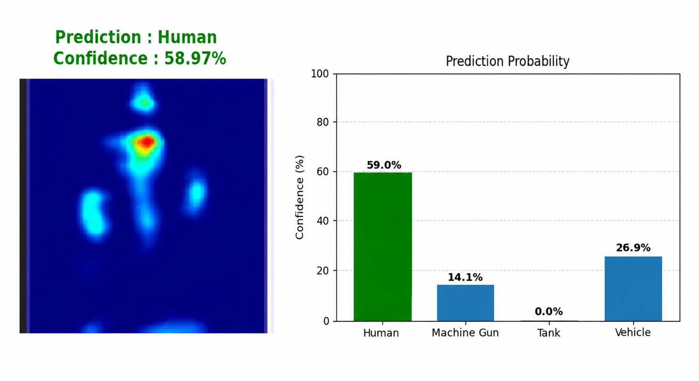
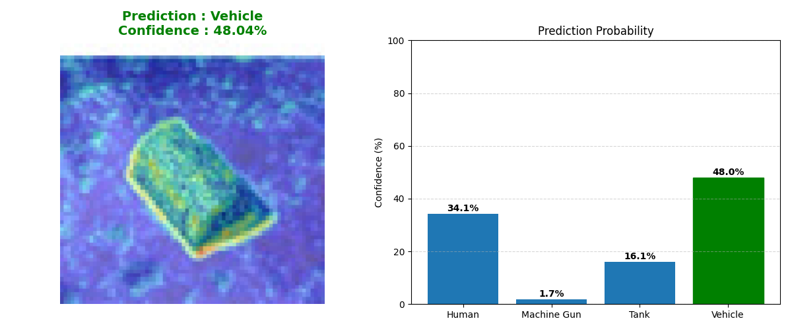

# Radar Object Classification Using Deep Learning

## Project Overview

This project focuses on classifying radar images into four different object categories using a deep learning model.

The four target classes are:

- Human
- Machine Gun
- Tank
- Vehicle

Output Example

The following image shows a sample prediction generated by the trained model.

The model is based on MobileNetV2 with ImageNet pretrained weights and is trained using our own synthetically generated radar image dataset.

## Objectives

The main objectives of this project are:

- To classify radar images into four object categories.
- To develop a deep learning-based radar image classification system.
- To use MobileNetV2 as the base architecture.
- To train the model using our own radar dataset.
- To fine-tune the model to improve classification performance.
- To evaluate the model using accuracy, confusion matrix, and classification report.
- To test the trained model on new radar images.

## Dataset

We created and used our own synthetic radar image dataset.

The dataset contains four classes:

- Human
- Machine Gun
- Tank
- Vehicle

The dataset was divided into:

- 80% Training
- 10% Validation
- 10% Testing

The images were organized into separate folders according to their respective classes.

## Model Architecture

MobileNetV2 is used as the base model with ImageNet pretrained weights.

The base MobileNetV2 model is used without its original classification layer.

The following layers are added for our four-class classification task:

- Global Average Pooling
- Batch Normalization
- Dense layer with 128 neurons and ReLU activation
- Dropout with a rate of 0.4
- Dense output layer with 4 neurons and Softmax activation

The model uses the Adam optimizer with a learning rate of 0.0001 and sparse categorical cross-entropy as the loss function.

## Training Approach

The model was trained in two stages.

### Initial Training

During the initial training stage, the pretrained MobileNetV2 base layers were frozen.

Only the newly added classification layers were trained using our radar dataset.

### Fine-Tuning

After the initial training, the model was fine-tuned by unfreezing the last layers of MobileNetV2.

A smaller learning rate was used during fine-tuning so that the pretrained features could be adapted to the characteristics of our radar dataset.

## Technologies Used

- Python
- TensorFlow
- Keras
- MobileNetV2
- NumPy
- Pandas
- Matplotlib
- Scikit-learn
- OpenCV
- Pillow

